# Белая башня

Полный дизайн документ браузерной головоломки

Версия 1.0 • 8 октября 2026 года • Рабочее название White Tower

Игрок нажимает на белые плитки с оранжевыми стрелками. Плитка или уже собранная башня движется по полю, забирает другие плитки и меняет направление на жёлтых клетках с белыми шевронами. Цель уровня — собрать все белые плитки в одну башню. Игра запускается по ссылке, управляется одним пальцем или мышью и сохраняет минималистичный вид приложенного видео.

Документ задаёт правила, визуальную спецификацию, интерфейс, контент, технические требования и критерии готовности для разработки. Основной художественный ориентир — сам видеоролик и приложенные кадры в исходном разрешении 720 × 1280. Новое рабочее название не выводится поверх игрового поля.

## 1 Концепция и границы продукта

Жанр — короткая пространственная головоломка со сбором стопок. Формат — одиночная браузерная игра с последовательными уровнями. Типичная сессия: 3–10 минут; целевое время решения одного уровня: 10–90 секунд. Эти значения являются целями дизайна, а не замерами аудитории.

Основное удовольствие — заранее увидеть маршрут, выбрать правильную стрелку, наблюдать увеличение башни и закончить поле одним компактным объектом. Ошибка должна давать полезную информацию, а отмена — позволять сразу попробовать другой порядок.

В основном режиме нет таймера, жизней, энергии, валюты, обязательной регистрации или наказания за перезапуск. Внешний вид поля не меняется по мере прогресса: голубое пространство, белые плитки, жёлтый пол, оранжевые стрелки, простые тени. Сложность растёт за счёт расположения объектов и порядка действий.

Целевая аудитория — люди, которым нравятся понятные короткие головоломки. Не требуется опыт в играх или чтение длинного обучения. Возрастная и магазинная классификация определяется отдельно при выборе площадок; данный GDD не присваивает игре официальный рейтинг.

Релизный объём по этому проекту: 120 вручную проверенных уровней, выбор уровня, бесплатная отмена, перезапуск, подсказка из меню, настройки звука и доступности, локальные сохранения и офлайн запуск после успешного кэширования. До релиза выполняется вертикальный срез из 12 уровней.

## 2 Что действительно показано в видео

Технические свойства файла: длительность около 113,92 секунды; вертикальное видео 720 × 1280; видеопоток 60 кадров в секунду; присутствует аудиопоток. Частота видео не является подтверждением частоты работы исходной игры. Музыкальные и звуковые параметры ниже задаются для новой игры отдельно.

В ролике видны уровни с метками Lv.1–Lv.11. На экране находятся настройки слева сверху, перезапуск справа сверху, счётчик X/N в центре сверху, номер уровня слева и кнопка UNDO снизу. После решения появляется зелёная наклонная лента LEVEL COMPLETED! и кнопка NEXT. Основная камера неподвижна. Высокая башня может подниматься почти до верхнего края экрана.

Белые объекты состоят из отдельных тонких квадратных плиток со скруглёнными или скошенными краями. Под собранными плитками открывается жёлтое поле. Оранжевая стрелка обозначает запускаемый объект. В более поздних уровнях видны жёлтые клетки с пульсирующими белыми шевронами, которые меняют маршрут движущейся стопки.

Наблюдение не раскрывает исходный код и внутренние правила. События указателя в файле не показаны явно. Поэтому автодвижение после одного нажатия, точный способ расчёта X, правила поглощения другой стрелки, защита от циклов и работа сохранений ниже закрепляются как правила новой игры. Их нужно сверить на интерактивном прототипе с последовательностями видео. Визуальное совпадение является обязательным требованием независимо от этих уточнений.

Идентификаторы кадров R01–R12 используются в тексте и в приложении. Временные отметки относятся к исходному файлу. Это извлечённые кадры, без перерисовки или замены изображения генерацией.

| Кадр | Время | Содержание | Для чего использовать |
| --- | --- | --- | --- |
| R01 | 00:00,000 | Старт Lv.1, ряд из четырёх плиток | Базовая композиция, HUD, цвет фона |
| R02 | 00:01,500 | Сбор первого ряда | Увеличение стопки, открытие пола |
| R03 | 00:04,400 | Старт Lv.2, две ветви | Простые формы и несколько стрелок |
| R04 | 00:08,500 | Старт Lv.3 | Разные направления стрелок |
| R05 | 00:13,000 | Старт Lv.4, семь плиток | Разреженное поле и стрелка вправо |
| R06 | 00:23,000 | Старт Lv.6, четырнадцать плиток | Плотное поле и много направлений |
| R07 | 00:33,000 | Высокая башня после сбора | Высота сегментов и направление тени |
| R08 | 00:35,000 | Старт Lv.7, кольцо | Шевроны и пустой центр |
| R09 | 00:57,000 | Старт Lv.9 | Внутренние стрелки и повороты |
| R10 | 01:21,000 | Старт Lv.11 | Вытянутое поле и коридор поворотов |
| R11 | 01:41,000 | Промежуточное состояние Lv.11 | Несколько стопок и активный маршрут |
| R12 | 01:53,000 | Завершение уровня | Затемнение, зелёная лента, NEXT |

## 3 Требования к визуальному совпадению

Эталонный режим имеет логический холст 720 × 1280. На телефоне с соотношением 9:16 он занимает доступную игровую область. На другом экране эталон масштабируется без растяжения. Пространство вокруг заполняется тем же голубым цветом. Не добавлять рамку устройства, фон комнаты, панели с наградами, персонажей или новые эффекты вокруг поля.

Визуальная приёмка выполняется сначала на 720 × 1280. Совпадение означает одинаковую композицию, размер клеток, высоту слоёв, направление стрелок, положение HUD, цветовые отношения и характер движения. Сжатие исходного MP4, отличия сглаживания и округление пикселей не должны трактоваться как требование копировать артефакты видео.

На широком экране центральная область остаётся вертикальной. Поддержка разных устройств не должна превращать поле в другую игру. На очень узком или низком экране разрешено увеличить доступные области нажатия и уменьшить поле равномерным масштабом. Эти изменения не входят в сравнение пикселей эталонного режима.

До расширения контента команда делает визуальный срез: старт R01, плотное поле R06, кольцо R08, высокий стек R07 и победа R12. Новые уровни создаются только после принятия этого среза владельцем продукта.

## 4 Игровой цикл

Первый запуск открывает первый уровень после загрузки необходимых ресурсов. Игрок видит поле и стрелку. Первое нажатие запускает сбор по заданному маршруту. Башня растёт; освобождённые клетки становятся видимым жёлтым полом. После завершения движения игрок выбирает следующую стрелку либо отменяет действие.

Победа наступает, когда все белые плитки находятся в одной стопке. Сохранение прохождения выполняется до появления NEXT. Игрок нажимает NEXT и сразу получает следующий уровень. После последнего уровня появляется компактное сообщение о завершении всех 120 уровней с переходом к выбору уровня.

Проигрыша с потерей ресурсов нет. Если несколько стопок остаются раздельно и больше нет полезных активных стрелок, состояние считается тупиком. Игрок использует UNDO или перезапуск. Автоматическое переключение на новый уровень запрещено: оно мешает рассмотреть результат и не соответствует видео.

## 5 Формальная модель поля

Поле — набор клеток на двумерной целочисленной решётке. Каждая клетка имеет координаты (u, v), тип пола и, при необходимости, предписанное направление. Отсутствующая клетка означает край или отверстие. Стопка находится ровно в одной клетке и имеет целую высоту h ≥ 1. Общее число белых плиток N постоянно в течение уровня.

Типы пола: обычный жёлтый; жёлтый направляющий с белыми шевронами; непроходимая клетка. В референсе центр кольца сначала выглядит как голубое отверстие, а позднее может читаться как голубой выступ из-за тени и перекрытия. Для реконструкции он является непроходимой областью. Конкретную геометрию синего центра художник сверяет с R08 и поздними кадрами кольца.

Активная стопка имеет оранжевую стрелку запуска. Пассивная стопка не имеет стрелки и не запускается самостоятельно. После остановки активная стрелка расходуется; собранная башня остаётся пассивной и может быть поглощена другой движущейся стопкой.

Для отображения применяется фиксированная проекция: screenX = originX + (u − v) × a; screenY = originY + (u + v) × b − z × c. Стартовая калибровка a = b = 80 пикселей для эталона, затем уточняется наложением кадров. Равенство a и b создаёт верхнюю грань в виде ромба с диагоналями приблизительно 1:1, как в видео. Это не обязательная камера с углом классической изометрии 30 градусов.

Отображаемое направление стрелки рассчитывается из вектора (du, dv), а не задаётся независимо от логики. Порядок слоёв или глубина в 3D должны обеспечивать правильное перекрытие передними гранями и башнями.

| Направление на экране | Вектор решётки | Название в данных |
| --- | --- | --- |
| Вниз вправо | (1, 0) | SE |
| Вниз влево | (0, 1) | SW |
| Вверх влево | (−1, 0) | NW |
| Вверх вправо | (0, −1) | NE |
| Вправо | (1, −1) | E |
| Влево | (−1, 1) | W |
| Вверх | (−1, −1) | N |
| Вниз | (1, 1) | S |

Движение по диагонали решётки проверяет клетку назначения. Две соседние боковые клетки не обязаны существовать: это позволяет маршруту со стрелкой вверх на поле R04. Нельзя перепрыгивать через отсутствующую клетку вдоль текущего вектора.

## 6 Правила одного хода

Нажатие допустимо только в состоянии ожидания и только по активной стопке. Игрок не выбирает направление жестом: оно задано оранжевой стрелкой. Одно нажатие запускает полный маршрут до остановки. В процессе маршрута другие ходы не принимаются.

Алгоритм является нормативным правилом новой игры. Его предпосылки о расходовании стрелки и столкновении стрелок требуется проверить при воспроизведении Lv.3, Lv.4 и Lv.11.

1. Создать снимок состояния до хода и вычислить маршрут без изменения опубликованного состояния.
2. Если под стартовой стопкой находится направляющая клетка, её вектор имеет приоритет над стрелкой запуска. В первых обучающих уровнях такие комбинации не используются.
3. Рассчитать следующую клетку по текущему вектору. Если клетки нет или она непроходима, остановить маршрут перед ней.
4. Перенести всю движущуюся стопку в следующую клетку. Предыдущая клетка сохраняет свой пол и освобождается.
5. Если клетка занята другой стопкой, сложить высоты: hNew = hMoving + hTarget. Оранжевая стрелка целевой стопки исчезает; движение продолжает входящий вектор.
6. Если на полу клетки назначения есть шевроны, заменить текущий вектор на указанный ими. Шевроны остаются на поле и могут сработать повторно.
7. Повторять шаги 3–6 до края либо до обнаружения цикла. На остановившейся стопке убрать оранжевую стрелку.
8. Зафиксировать итог и проиграть рассчитанные шаги. Обновлять видимый счётчик в момент соответствующего поглощения. Проверить победу после финальной анимации остановки.

При поглощении башен сохраняются все плитки, включая нижние слои. Делить стопку, вытеснять её на соседнюю клетку или уничтожать плитки нельзя. Направляющая клетка работает и тогда, когда сверху на ней до хода лежала белая плитка.

Если первый шаг невозможен, показать короткое покачивание и оставить стрелку активной. Такой клик не создаёт ход и запись в истории. Если движущаяся башня проходит по уже пустому жёлтому полу, она продолжает движение без изменения высоты.

Цикл определяется по повторению полного состояния маршрута: координаты, направление и оставшиеся неподвижные стопки со стрелками. К одному циклу нельзя относить возврат в клетку после новых поглощений. Зацикленный ход не публикуется, воспроизводится короткое покачивание и предлагается другая стрелка. Редактор не допускает подобные ходы в релизный контент. Аварийный лимит 4096 шагов защищает приложение от повреждённых данных.

## 7 Счётчик победа и тупики

N — сумма высот всех стартовых стопок. X — высота самой большой текущей стопки, если она содержит минимум две плитки; иначе X = 0. Поэтому стартовое состояние показывает 0/N, а не 1/N. Во время одного маршрута X обновляется после каждого слияния; при отмене восстанавливается из состояния.

Такой расчёт соответствует видимой последовательности первого уровня 0/4 → 2/4 → 3/4 → 4/4 и обеспечивает понятный прогресс. Внутренняя формула исходной игры неизвестна: выбор максимума закреплён для новой игры и отдельно проверяется на сценах с несколькими башнями.

Условие победы: ровно одна занятая клетка и высота стопки равна N. Победа не зависит от числа оставшихся стрелок или процента открытого пола. Значение N не включает клетки поворота, пустой пол и отверстия.

Локальная проверка тупика: при нескольких стопках не осталось ни одного допустимого запуска. Полная проверка: решатель не находит последовательности до единой башни. Для релизных малых уровней полную проверку можно выполнять в отдельном потоке после каждого хода, не блокируя анимацию. При истечении бюджета поиска сообщение о тупике не показывается.

В режиме точного визуального соответствия тупик не открывает крупное окно. Через 0,6 секунды после остановки под UNDO на 2 секунды появляется текст «Попробуйте отменить ход». В настройках доступности этот текст может озвучиваться средствами браузера. Скрытые состояния не должны ошибочно объявляться проигрышем.

## 8 Отмена перезапуск и подсказки

UNDO восстанавливает состояние перед последним полноценным ходом: координаты всех стопок, их высоты и стрелки, текущий счётчик и флаги уровня. Один длинный маршрут с несколькими поворотами отменяется одним действием. Отмена бесплатна и доступна до начала следующего уровня. После отмены победы лента исчезает, а уровень снова становится интерактивным; отметка «пройден» в коллекции не удаляется.

История хранит минимум все ходы текущей попытки. При загрузке страницы восстанавливается последний устойчивый снимок и до 50 предыдущих ходов. Во время анимации UNDO и Restart визуально приглушены. Нажатия по ним не ставятся в очередь; пользователь повторяет действие после остановки.

Restart немедленно восстанавливает исходное поле без подтверждения, очищает историю текущей попытки и сохраняет разблокированные уровни. Счётчик возвращается к 0/N. Кнопка остаётся справа сверху, как в R01. R на клавиатуре делает то же самое, если фокус находится в игре, а не в текстовом поле.

Подсказка открывается из настроек, чтобы не добавлять новую кнопку к референсному HUD. Она выделяет одну стрелку, которая ведёт к решению из текущего состояния. Если решение требует отмены, текст сообщает «Отмените последний ход». Подсказки бесплатны; они не запускают ход и не гарантируют уникальное решение. В релизе запрещено показывать случайную стрелку при незавершённом поиске.

## 9 Управление и состояния приложения

На сенсорном экране используется одиночное короткое нажатие. На компьютере — основная кнопка мыши. Свайпы и перетаскивание не нужны. Срабатывание происходит на pointerup, если контакт завершился на том же объекте и смещение не превышает 12 CSS пикселей. Pointercancel не делает ход. Второй палец игнорируется, пока первый контакт активен.

Область нажатия на стрелку включает всю верхнюю грань стопки и небольшую добавку, но не перекрывает соседнюю цель. При пересечении целей выбрать ближайшую видимую верхнюю грань по глубине и расстоянию. Нельзя нажать невидимую стрелку сквозь переднюю башню. Для закрытых башней предусмотреть доступ через клавиатуру и аккуратное выделение доступной грани.

Клавиатура: Tab перемещает фокус по DOM кнопкам; стрелки клавиатуры циклически выбирают активные стопки в порядке по экранным координатам; Enter или Space запускают выбранную; Ctrl+Z или Z отменяют; R перезапускает; Escape открывает или закрывает настройки. Браузерные сочетания не перехватываются глобально вне игры.

При скрытии вкладки вычисленная анимация ставится на паузу, звук прекращается. После возвращения игра продолжает с той же временной позиции. При перезагрузке в середине маршрута восстанавливается устойчивый итог хода, а не половина перемещения. Это исключает потерю плиток и расхождение между изображением и логикой.

| Состояние | Доступные действия | Переход |
| --- | --- | --- |
| Loading | Настройки звука после готовности UI | Idle или LoadError |
| Idle | Запуск, Undo, Restart, меню | Animating или Menu |
| Animating | Пауза при скрытии вкладки | Idle или Won |
| Won | Next, Undo, Restart, меню | Loading следующего уровня или Idle |
| Menu | Настройки, выбор уровня, подсказка, закрытие | Предыдущее устойчивое состояние |
| LoadError | Повторить загрузку, открыть кэшированный уровень | Loading или Idle |
| Unsupported | Описание ограничения и облегчённый режим | Loading при доступном 2D пути |

## 10 Уровни и обучение

Уровни обучают действиям через форму поля. В первом уровне доступна одна стрелка и прямой маршрут; текст «Нажмите на стрелку» появляется только после 2 секунд без действия и исчезает после первого хода. Подсказка не закрывает поле. В основном режиме используется компактный интерфейс референса без отдельного обучающего окна.

Обучение Lv.2 вводит две ветви, которые нужно объединить. Lv.3 показывает направления, визуально отличающиеся от движения вдоль ребра ромба. Более крупные поля вводят порядок запуска, а кольцо демонстрирует автоповороты на шевронах. Отмена становится понятной после первой ошибки и доступна с самого начала.

Первые одиннадцать эталонных сцен восстанавливаются по расположению клеток и стрелок. Таблица фиксирует видимый масштаб, а не готовые координатные данные всех сцен. Для разработки необходимо обвести каждую клетку по кадру и проверить маршруты; числа белых плиток считываются из знаменателя счётчика.

| Уровень в видео | Белых плиток | Основной визуальный мотив |
| --- | --- | --- |
| 1 | 4 | Прямой ряд |
| 2 | 5 | Две сходящиеся ветви |
| 3 | 4 | Компактный ромб |
| 4 | 7 | Малое поле с ответвлением |
| 5 | 8 | Продолговатая фигура с жёлтыми участками |
| 6 | 14 | Плотное поле со срезами |
| 7 | 5 | Кольцо с тремя поворотами |
| 8 | 5 | Малое поле с поворотом |
| 9 | 13 | Плотное поле с поворотами по краям |
| 10 | 9 | Компактное поле со смешанными стрелками |
| 11 | 12 | Две группы с коридором шевронов |

Полная кампания содержит шесть блоков по 20 уровней. Новые блоки не добавляют новые цвета, объекты или валюту. Порядок внутри блока перемежает сложные и короткие решения. Каждые 5–7 уровней встречается лёгкий уровень для передышки.

| Блок | Уровни | Размер поля и плиток | Задача дизайна |
| --- | --- | --- | --- |
| Основы | 1–20 | 4–14 плиток, до 4 × 4 | Запуск, слияние, порядок, Undo |
| Повороты | 21–40 | 6–18 плиток, до 5 × 5 | Цепочки направляющих клеток |
| Пересечения | 41–60 | 8–22 плитки, до 5 × 5 | Общие маршруты нескольких стрелок |
| Пустые пути | 61–80 | 10–26 плиток, до 6 × 6 | Движение по освобождённому полу |
| Порядок сборки | 81–100 | 12–30 плиток, до 6 × 6 | Временные пассивные башни |
| Комбинации | 101–120 | 14–36 плиток, до 7 × 7 | Сочетание знакомых правил |

Максимальная размерность является верхней границей. Если при равномерном масштабировании активные цели становятся меньше 44 CSS пикселей на тестовом телефоне, поле сокращается или перестраивается. Вводить многослойный лабиринт ради количества плиток нельзя.

Каждый уровень имеет хотя бы одно решение. Для первых двадцати уровней дизайнер записывает объяснение в одну фразу. Поздние уровни допускают несколько решений. Уникальность не является требованием; решение не должно зависеть от скорости клика, частоты кадров или незаметных пикселей.

Сложность описывается числом активных стрелок, минимальным количеством запусков, числом значимых развилок порядка и количеством ошибочных последовательностей. Одно большое поле с единственной стрелкой может быть легче маленького с пятью независимыми действиями. Размер не используется как единственная оценка.

## 11 Координатные примеры для прототипа

В пакете приложены четыре JSON уровня. Они являются исполнимыми примерами модели и не заменяют покадровую разметку всей кампании. Стартовые плитки имеют высоту 1. Имена SE, SW, NW, NE, E, W, N, S относятся к таблице направлений выше.

Пример A соответствует идее первого уровня: клетки (0,0), (1,0), (2,0), (3,0), активная стрелка SE в (0,0). Один запуск собирает стопку высотой 4 в (3,0). Счётчик проходит 0/4, 2/4, 3/4, 4/4.

Пример B соответствует двум ветвям: клетки (0,0), (1,0), (2,0), (0,1), (0,2). Стрелки NW в (2,0) и NE в (0,2). Запуск любой ветви сначала оставляет пассивную башню 3 в (0,0). Вторая ветвь собирает оставшиеся две плитки и поглощает башню. Итог — 5 в (0,0).

Пример C соответствует малому ромбу: клетки (0,0), (1,0), (0,1), (1,1). Стрелки N в (1,1), NE в (0,1), NW в (1,0). Для эталонной последовательности сначала запускается нижняя, затем левая, затем правая. Итог — башня 4 в (0,0). Перестановки проверяются решателем, а не запрещаются без основания.

Пример D соответствует кольцу: все клетки квадрата 3 × 3, кроме (1,1). Белые плитки находятся в (0,0), (1,0), (2,1), (1,2), (0,1). Стрелка SE стоит в (0,0). Направляющие: SW в (2,0), NW в (2,2), NE в (0,2). Один запуск проходит вокруг отверстия, возвращается в (0,0) и останавливается перед краем. Итог — башня 5 в (0,0).

Контрольный набор должен включать дополнительно тупик с двумя пассивными башнями, запрещённый циклический маршрут, поглощение активной стрелки, проход по пустому полу, отмену многократного поворота и непроходимую диагональную цель.

## 12 Художественная спецификация

Фон ровный голубой без градиента, облаков, сетки и горизонта. Для стартового кадра самый частый цвет извлечённого изображения равен RGB (96, 192, 254), то есть #60C0FE. Это измерение декодированного кадра, а не исходного материала автора. Остальные значения палитры ниже — стартовые приближения для калибровки по скриншотам.

| Элемент | Цвет начала калибровки | Характер |
| --- | --- | --- |
| Фон | #60C0FE | Однотонный |
| Верх белой плитки | #F4F4F4 | Матовый, почти белый |
| Боковая грань | #DDDFDC | Светло серая |
| Нижний шов | #C9CFCA | Тонкий, не чёрный |
| Жёлтый пол | #FFDD28 | Насыщенный, тёплый |
| Швы пола | #EAC125 | Ненавязчивые |
| Оранжевая стрелка | #FF951C | Заполненный силуэт |
| HUD и кнопка Undo | #3C7EA9 | Полупрозрачное впечатление |
| Тень | #3D83D2 | Голубая, уходит вверх влево |
| Баннер победы | #52E000 | Ярко зелёный |
| Нижняя грань кнопки Next | #38C600 | Темнее верхней поверхности |
| Текст и шевроны | #FFFFFF | Белый |

Размер одной клеточной верхней грани при базовом масштабе: ориентировочно 160 × 160 пикселей по диагоналям. Белая плитка немного уже клетки, чтобы между соседними плитками оставался узкий шов. Контур без чёрной обводки. Начальные отношения в мировых единицах: шаг клетки 1, ширина плитки 0,94, высота одного слоя 0,16, фаска 0,035–0,05. Итоговые значения выбираются по R01, R06 и R07.

Белая стопка обязана оставаться набором отдельных одинаковых плиток. Нельзя заменять её вытянутым гладким кубом. На высокой башне читаются слои и светлые фаски. Верхняя стрелка лежит на верхней грани с малым смещением от поверхности, чтобы избежать мерцания глубины. Масштаб стрелки не зависит от высоты башни.

Пол — плоские жёлтые квадраты с небольшим перепадом или швом; край основания имеет небольшую толщину. Тени направлены вверх влево по экрану; свет приходит с противоположной стороны. Для точного совпадения предпочтительна вручную контролируемая тень с небольшим смягчением, а не дорогая физически точная система освещения.

Оранжевая стрелка имеет короткий широкий стержень и крупный наконечник. Поворот выполняется в плоскости верхней грани; нельзя поворачивать экранный спрайт так, чтобы он перестал лежать на ромбе. Белые направляющие используют два коротких шеврона и мягко меняют прозрачность. Состояние направления не кодируется только цветом.

Материалы матовые, без металлических бликов, зеркального отражения, текстур дерева, зерна и выраженного ambient occlusion. Сглаживание краёв аккуратное. Bloom, глубина резкости, motion blur и частицы не входят в эталонный вид.

## 13 Камера масштаб и композиция

Камера ортографическая или её точный 2D эквивалент. Перспективное уменьшение дальних плиток не допускается. Азимут стартовой 3D камеры — около 45 градусов к осям поля. В физической ортографической проекции отношение b/a приблизительно равно синусу угла возвышения: почти равные диагонали требуют взгляда близко сверху. Вертикальный масштаб стопки калибруется отдельно, при необходимости художественной проекцией. Для 2D эквивалента стартовое c = 80 пикселей на мировую единицу даёт около 13 пикселей на слой высотой 0,16. Не переносить автоматически пресет «изометрия 30 градусов».

В эталоне центры элементов HUD ориентировочно: настройки (76,93), Restart (644,93), счётчик (360,125), Undo (360,1123). Номер уровня расположен около (35,158). Эти точки сняты с R01 и уточняются с учётом реальных размеров кнопок. Верхняя грань поля чаще занимает центральную и нижнюю части экрана, а верх оставляет место растущей башне.

Стартовая посадка поля: ограничивающий прямоугольник основания помещается в диапазон x = 65…655 и y = 440…1010. Для короткого первого ряда диапазон уже. Это ориентир, а не требование растянуть любой уровень на одну ширину. Размер клеток остаётся близким между ранними уровнями, насколько позволяет фигура.

Для новой кампании камера заранее учитывает максимальную башню N слоёв. На уровне 720 × 1280 игровой объём не должен пересекать счётчик и кнопку Undo. Масштаб фиксируется при входе на уровень; рост башни не вызывает неожиданного отдаления. Если художественная реконструкция R07 требует башню почти до верхней границы, это отдельный эталонный пресет с теми же пропорциями слоёв.

На desktop холст вписывается в доступную высоту и ширину, предпочтительно сохраняя 9:16. На landscape мобильном экране кнопки меню могут сместиться в безопасные боковые области, а поле масштабируется равномерно. Принудительный поворот устройства, полноэкранный режим и скрытие системных панелей не обязательны для игры.

## 14 Анимации и обратная связь

Движение сочетает короткое перемещение к соседней клетке, небольшой наклон или перекат и подъём растущей стопки. Референс требует ощущения физического складывания, поэтому простое линейное скольжение плоского спрайта недостаточно. Точный угол, ось и порядок подъёма подбираются просмотром исходного видео на пониженной скорости.

Ниже заданы начальные времена прототипа. Это параметры новой игры, которые корректируются по видеосравнению, а не извлечённые длительности оригинальной анимации. Вся механика вычисляется до воспроизведения; пропуск кадров не меняет результат.

| Событие | Начальное время | Отображение |
| --- | --- | --- |
| Нажатие | 60–90 мс | Малое проседание или акцент стрелки |
| Шаг по клетке | 140–190 мс | Перекат или наклон без сильной пружины |
| Поглощение | 90–130 мс внутри шага | Добавление слоя и мягкое оседание |
| Поворот | 80–120 мс | Направление стрелки меняется до нового шага |
| Остановка | 100–160 мс | Короткая стабилизация башни |
| Undo | 160–220 мс | Восстановление объектов без долгого маршрута назад |
| Победа | 250–350 мс после остановки | Затемнение и въезд зелёной ленты |
| Смена уровня | 180–260 мс | Короткое затухание и новое поле |
| Пульсация шевронов | 700–1100 мс период | Прозрачность примерно 0,45…1 |

Сбор по пустым клеткам не должен быть быстрее настолько, что игрок теряет маршрут. Протяжённые уровни проектируются с разумной длиной анимации; целевой максимум одного действия — 3,5 секунды на нормальной скорости. Ускорение анимации доступно в меню как дополнительная настройка после обучения.

Победная лента проходит почти на всю ширину и слегка наклонена, как R12. Текст белый, жирный, в две строки. Декоративные белые диагональные полосы допускаются только в объёме, показанном в видео. Зелёная NEXT имеет светлый верх и тёмный низ, лёгкий наклон и тень. Конфетти, монеты и окно оценки не добавлять.

В режиме уменьшенного движения отключаются пульсация и выраженный перекат. Остаются короткие перемещения до 100 мс или мгновенное обновление с акцентом цели. Это режим доступности, его изображение не участвует в эталонном сравнении анимации.

## 15 Интерфейс и тексты

Игровой экран максимально повторяет видео. Основной язык референсного HUD — английский: Lv., UNDO, LEVEL COMPLETED!, NEXT. Русская локализация доступна в настройках; исходный английский выбран по умолчанию для визуального сравнения. Замена текстов в локализации сохраняет размер блоков и не меняет расположение поля.

Шрифт — простой жирный гротеск для счётчика, UNDO, NEXT и победы; номер уровня менее контрастный и меньшего размера. Конкретный шрифт исходной игры не установлен. Выбрать доступный для проекта шрифт с близкой шириной и формой букв, затем сравнить реальные текстовые блоки. Если используется отдельный файл шрифта, поставлять только нужные начертания и наборы символов.

Настройки открываются поверх устойчивого поля и содержат звук, музыку, уменьшенное движение, язык, подсказку, выбор уровня и возврат. Меню не заменяет первоначальный запуск игры. Все изменённые значения сохраняются сразу. Очистка прогресса размещается отдельно внизу меню и требует подтверждения, поскольку удаляет сохранения.

Выбор уровня — сетка простых карточек с номером, отметкой прохождения и замком. Доступны все ранее открытые уровни и следующий. Последний выбранный уровень сохраняется. Полные решения и статистика не выводятся поверх игрового поля.

При первой загрузке показывается однотонный голубой экран с небольшим индикатором прогресса. При сетевой ошибке — «Не удалось загрузить игру» и «Повторить». При недоступном хранилище — ненавязчивое сообщение в настройках «Прогресс сохранится только до закрытия страницы». Играть можно независимо от наличия постоянного хранилища.

| Ключ | Референсный английский | Русский |
| --- | --- | --- |
| action.undo | UNDO | НАЗАД |
| action.next | NEXT | ДАЛЕЕ |
| win.title | LEVEL COMPLETED! | УРОВЕНЬ ПРОЙДЕН! |
| tutorial.tap | Tap the arrow | Нажмите на стрелку |
| hint.undo | Undo the last move | Отмените последний ход |
| game.stuck | Try undoing a move | Попробуйте отменить ход |
| action.retry | Retry | Повторить |

## 16 Звук и ощущения

Звуки короткие и тихие: нажатие, лёгкий стук при сборе плитки, более низкий звук оседания большой башни, мягкий поворот, Undo и короткое подтверждение победы. Громкость не растёт бесконечно с высотой стопки. При быстром сборе повторяющиеся звуки ограничиваются, чтобы не образовать неприятный треск.

Звуковая спецификация новой игры: 6–8 коротких эффектов, один необязательный спокойный музыкальный цикл. Музыка отключена по умолчанию для чистого первого опыта; эффекты разрешены после первого взаимодействия пользователя, если браузер допускает запуск звука. Не делать вывод о музыкальном оформлении оригинала только по наличию AAC дорожки.

Форматы и декодирование проверяются на целевых браузерах. Исходники звука хранятся в lossless формате, в сборку входят компактные совместимые версии. На скрытой вкладке аудио приостанавливается. Отказ устройства воспроизведения не мешает прохождению.

Короткий отклик вибрации можно включать только там, где доступен соответствующий API и пользователь не отключил эффект. Вибрация не является обязательным сигналом победы или ошибки. Любое звуковое событие имеет визуальный эквивалент.

## 17 Доступность и платформы

«Все платформы» в этом проекте означает единый браузерный продукт для компьютеров, телефонов и планшетов с максимально широкой поддержкой актуальных браузеров. Абсолютная поддержка любого существующего устройства, старого встроенного браузера, телевизора или закрытой консоли не задаётся как проверяемое обещание.

Обязательная матрица: Windows, macOS, Linux и ChromeOS; Android телефоны и планшеты; iPhone и iPad. На релизе проверяются текущая стабильная и предыдущая стабильная версии браузеров там, где их можно реально установить. Точные версии записываются в отчёт о совместимости на дату релиза.

| Класс | Браузеры в обязательной проверке | Ввод и ориентации |
| --- | --- | --- |
| Windows | Chrome, Edge, Firefox | Мышь, клавиатура, узкое и широкое окно |
| macOS | Safari, Chrome, Firefox | Мышь или трекпад, клавиатура |
| Linux и ChromeOS | Chrome или Chromium, Firefox где доступен | Мышь, клавиатура |
| Android | Chrome, Samsung Internet; Firefox вторым приоритетом | Touch, portrait и landscape |
| iPhone | Safari; Chrome отдельной проверкой | Touch, safe area, изменение панелей браузера |
| iPad | Safari, Chrome | Touch, landscape, split view |
| Встроенные браузеры | Только после выбора площадки | Проверка ограничений контейнера |
| ТВ и консоли | Дополнительный эксперимент после релиза | Навигация пультом или геймпадом |

Необходимые случаи размеров: 320 × 568, 360 × 640, 390 × 844, 412 × 915, 768 × 1024, 1024 × 768, 1366 × 768 и 1920 × 1080 CSS пикселей. Высота области меняется вместе с браузерными панелями. Использовать доступный viewport и отступы безопасной области; нельзя прятать Undo под нижней системной полосой.

Минимальная область интерфейсной кнопки — 44 × 44 CSS пикселя; для touch предпочтительнее 48 × 48. Размеры визуальной пиктограммы и области нажатия могут различаться. Контраст и фокус меню проверяются отдельно; эталонные приглушённые надписи могут усиливаться в режиме высокой контрастности.

Все кнопки имеют доступные имена. Рядом с canvas существует доступное текстовое представление активных стрелок и состояния счётчика. Например: «Стопка в клетке 2 1, три плитки, направление вверх вправо». Нельзя заявлять полную доступность пространственной головоломки только по добавлению aria-label: навигацию и озвучивание проверяют в реальном прохождении.

## 18 Техническая архитектура

Логика реализуется как отдельный детерминированный модуль на TypeScript без зависимости от рендера и DOM. Он получает состояние и действие и возвращает итог, список шагов анимации и события. Направления и координаты хранятся целыми числами; floating point используется только для отображения.

Стартовый вариант рендера для точного объёма — лёгкий WebGL слой с ортографической камерой, повторно используемой геометрией плитки и управляемыми тенями. Конкретная библиотека выбирается после сравнения размера сборки и совпадения R01/R07; GDD не закрепляет непроверенную версию движка. Интерфейс меню и доступные кнопки остаются в HTML поверх или рядом с canvas.

Для устройств без доступного WebGL предусмотрен 2D Canvas рендер с тем же игровым модулем и проекцией. Он рисует верх и боковые грани каждого слоя и упрощённую тень. Облегчённый путь сохраняет геометрию, цвета и правила, но может упрощать перекат. Он считается отдельным режимом совместимости, а не гарантией полного визуального совпадения анимаций.

WebGL работает в совместимом браузере при наличии необходимой поддержки устройства. Pointer Events объединяют обработку мыши, touch и пера. Возможности установки и офлайн работы PWA зависят от среды. Эти технические основания подтверждаются документацией MDN в разделе источников; приведённые ниже бюджеты являются целями проекта, а не обещаниями API.

Модули: загрузчик ресурсов; модель уровня; симулятор маршрутов; решатель; журнал Undo; рендер сцены; контроллер анимаций; ввод; интерфейс и локализация; хранилище; аудио; кэширование и обновление; необязательная аналитика. Решатель больших состояний запускается в Web Worker и имеет ограничение времени.

Физический движок не требуется. Коллизии задаются логическими клетками. Сеть не участвует в ходе и победе. Ошибка аналитики, музыки или серверного соединения не должна блокировать игру.

При потере WebGL контекста логика сохраняется; игра показывает короткую загрузку сцены и восстанавливает геометрию. При повторной потере предлагается облегчённый 2D режим. Установка приложения и fullscreen — дополнительные возможности; запуск по обычной ссылке остаётся базовым сценарием.

## 19 Данные уровней и редактор

Схема уровня: schemaVersion, id, title для внутреннего использования, cells, stacks, totalTiles, cameraPreset, tutorialKey, parMoves и knownSolution. Названия уровня и parMoves не обязаны показываться игроку. У клетки есть u, v, kind и необязательное direction; у стопки — u, v, height и необязательное launchDirection.

JSON не содержит произвольного исполняемого кода. Направления ограничены перечислением восьми значений. Проверки загрузчика: уникальность координат, наличие пола под стопкой, положительная высота, равенство totalTiles сумме высот, корректность направляющей, отсутствие стартовой победы и существование заявленного решения.

Редактор нужен как внутренний инструмент: размещение и удаление клеток, плиток и стрелок; поворот направления; настройка камеры; тестовое прохождение; Undo; проверка решателя; экспорт и импорт JSON; снимок для визуальной проверки. Он не входит в пользовательский интерфейс релизной игры.

Решатель перебирает доступные активные стопки, симулирует полные маршруты, исключает повторные состояния и сохраняет найденную последовательность. Для подсказки выбирается ближайший ход одного из решений. Производные значения вроде X не входят в ключ состояния, поскольку рассчитываются из стопок. Положение пола остаётся неизменным.

Контент проходит четыре стадии: дизайн → проверка решения → проверка читаемости и размера целей → включение в сборку. Проверка существования решения выполняется автоматически для каждого JSON в CI. Художественное качество не подменяется фактом, что решатель смог пройти уровень.

## 20 Сохранения офлайн работа и обновления

Игра запускается без аккаунта. Локальное сохранение содержит schemaVersion, contentVersion, unlockedLevel, completedLevels, selectedLevel, settings и текущий устойчивый снимок уровня с журналом Undo. Основное хранилище — IndexedDB; при его недоступности допускается небольшое сохранение в localStorage, затем память текущей страницы.

После каждого хода публикуются состояние и запись Undo, затем выполняется сохранение. Победа добавляет completedLevels и открывает следующий уровень атомарной операцией. Запись хранилища не должна повторно выдавать награду или увеличивать прогресс при двойном NEXT. Между несколькими вкладками действует последнее подтверждённое сохранение с временной меткой; активная вкладка не перезаписывает более новый прогресс при закрытии.

Первый релиз не включает обязательную синхронизацию между устройствами. В меню есть экспорт и импорт локального прогресса в JSON файл. При импорте проверяется версия и содержимое; пользователю показывается понятное подтверждение перед заменой текущего снимка. Облачная синхронизация и аккаунты относятся к отдельному расширению.

PWA кэширует оболочку, первые уровни и уже загруженные блоки контента. Полная офлайн кампания доступна после успешного скачивания всех блоков. Нельзя обещать офлайн первый запуск без предварительно загруженных ресурсов. Если следующий блок отсутствует в кэше, игра сообщает об этом и предлагает ранее доступные уровни.

Новая версия ресурсов устанавливается в фоне, но переключается только в устойчивом состоянии между уровнями. Состояние текущего уровня связано с contentVersion и контрольной суммой его данных. При несовместимом изменении уровня сохраняется общий прогресс, а текущая попытка перезапускается с объяснением в меню. Старый кэш удаляется только после успешного переключения.

## 21 Производительность и бюджеты

Цель — плавное движение на обычных современных телефонах. Эталонные целевые устройства команда фиксирует до оптимизации: минимум один Android среднего класса возрастом 3–4 года, один доступный iPhone, один Windows ноутбук со встроенной графикой и один iPad. Эти классы не заменяют измерение на конкретных моделях.

| Параметр | Цель проекта | Метод проверки |
| --- | --- | --- |
| Нормальный режим | 60 FPS при доступных ресурсах | Профиль длинных маршрутов |
| Облегчённый режим | Стабильные 30 FPS | Фиксация низкого качества |
| Реакция на нажатие | Видимый отклик ≤ 100 мс | Запись ввода и первого кадра |
| Первый интерактивный уровень | ≤ 3 с при 10 Мбит/с и RTT 100 мс | Холодная загрузка, три прогона |
| Начальная передача | ≤ 3 МБ сжатых ресурсов | Отчёт сборки и Network |
| Полная кампания | ≤ 12 МБ без QA кадров | Подсчёт загружаемых ресурсов |
| Память | Цель ≤ 150 МБ, уточнить на iOS | Длительная сессия на устройстве |
| Симуляция обычного хода | < 5 мс на эталонном устройстве | Замер модуля логики |
| Подсказка | Ответ до 300 мс для основной кампании | Замер решателя в Worker |

Если поиск не укладывается в бюджет, подсказка показывает индикатор и работает максимум 2 секунды, затем предлагает отмену без выдуманного решения. Кампания не включает уровни, у которых штатная подсказка регулярно зависает.

Оптимизация: общая геометрия плитки; ограничение devicePixelRatio, начально до 2; переиспользование объектов и материалов; простые тени; остановка лишнего рендера в неподвижной сцене; отложенная загрузка музыки и поздних уровней. Скриншоты референсов не входят в игровую сборку.

Качество понижается только по наблюдаемой нагрузке: сначала разрешение теней и пиксельная плотность, затем режим 30 FPS. Не менять цветовую палитру, толщину плиток и расположение стрелок. Проверять нагрев и расход батареи в 15 минутной сессии, а не только скорость одного уровня.

## 22 Аналитика и коммерческая модель

Базовый продукт полностью доступен без рекламы и покупок. Это проектное решение для первого релиза: бизнес модель в запросе не задана. Платные подсказки, энергия, ежедневные ограничения и рекламные окна не добавляются как скрытые обязательные требования.

При необходимости аналитика подключается независимым модулем. Основные события: session_start, level_start, move_committed, undo_used, restart_used, hint_requested, level_complete, level_exit, load_error, render_mode_changed. Событие level_complete отправляется один раз на попытку; attemptId отделяет повторное прохождение от первого.

Поля событий: версия клиента и контента, levelId, attemptId, порядковый номер хода, длительность активного времени, количество отмен и перезапусков, режим рендера, класс экрана. Не собирать текст пользовательских файлов, содержимое системы или сведения, которые не нужны для оценки игры. События на скрытой вкладке не увеличивают активное игровое время.

Исследовательские цели: большинство игроков понимает первый уровень без подсказки; первые пять уровней не вызывают случайных нажатий; сложные уровни провоцируют осмысленную отмену. Предварительные ориентиры для теста: ≥ 90% завершения Lv.1 и ≥ 70% достижения Lv.5 среди начавших игру. Это гипотезы проверки, а не прогноз удержания или дохода.

Если позднее выбрана реклама, её место ограничивается переходом после добровольного NEXT или отдельным добровольным действием. SDK площадки не должен менять эталонный игровой экран. Наличие рекламы, требования площадки и правила обработки данных оформляются отдельным решением до интеграции.

## 23 Производственный план и состав ресурсов

Минимальные функции команды: разработка игры и веб оболочки, художественная настройка и анимация, дизайн и проверка уровней, тестирование устройств. Один человек может совмещать роли, но художественная приёмка и проверка совместимости всё равно нужны. Сроки ниже — предварительная оценка для небольшой опытной команды, которая пересчитывается после среза.

| Этап | Ориентир | Проверяемый результат |
| --- | --- | --- |
| Разбор и логика | 3–5 рабочих дней | Четыре координатных примера, Undo, решатель |
| Визуальный срез | 5–8 дней | Пять эталонных состояний и движение |
| Вертикальный срез | 5–8 дней | 12 уровней, настройки, сохранение, touch |
| Кампания и редактор | 10–15 дней | 120 проверенных уровней и подсказки |
| Совместимость и оптимизация | 7–10 дней | Матрица устройств, офлайн, восстановление |
| Подготовка релиза | 3–5 дней | Сборка, итоговая приёмка, исправления |

При последовательной работе ориентир составляет 33–51 рабочий день. Часть задач может идти одновременно, но это не является гарантией более короткого календарного срока. Обнаруженная несовместимость механики с видео возвращает проект к прототипу до производства оставшихся уровней.

Ресурсы релиза: одна геометрия белой плитки с фаской; жёлтый пол и его край; оранжевая стрелка; белые шевроны; тень или её материал; четыре интерфейсные пиктограммы с состояниями; победная лента и NEXT; один основной шрифт с локализациями; звуковые эффекты; необязательная музыка; 120 JSON уровней; manifest и иконки PWA; тексты ошибок и доступности.

Для каждого ресурса хранятся исходник, экспорт, версия и назначение. Не извлекать интерфейс из JPEG кадров как финальную текстуру: элементы нужно восстановить чистой геометрией или вектором, чтобы они оставались чёткими на разных экранах. Кадры используются как контроль размеров и цветов.

## 24 Проверки и критерии приёмки

Механическая приёмка проверяет сохранение суммы высот после каждого шага, правильность поворотов, расходование стрелки, расчёт X, невозможность запуска пассивной стопки и независимость результата от частоты кадров. Уровень проходит решатель и реальные игроки; успешный автоматический поиск не заменяет проверку понятности.

| ID | Проверка | Ожидаемый результат |
| --- | --- | --- |
| M01 | Пример A, один запуск | Одна башня 4, счётчик 4/4 |
| M02 | Пример B, два порядка ветвей | В обоих случаях одна башня 5 |
| M03 | Пример C, N затем NE затем NW | Одна башня 4 в верхней клетке |
| M04 | Пример D, один запуск | Три поворота, башня 5, остановка в начале |
| M05 | Поглощение другой стрелки | Целевая стрелка исчезает, входящий маршрут сохраняется |
| M06 | Первый шаг за пределы поля | Нет хода, нет потери стрелки и новой истории |
| M07 | Undo после кольца | Восстановлены все пять плиток и исходная стрелка |
| M08 | Undo после победы | Поле интерактивно, баннер скрыт |
| M09 | Искусственный цикл | Ход отклонён, приложение не зависает |
| M10 | Быстрые двойные нажатия | Один опубликованный ход |
| S01 | Reload во время движения | Корректный устойчивый снимок, сумма N сохранена |
| S02 | Закрытая вкладка и возврат | Нет лишних ходов и наложенных звуков |
| S03 | Недоступное хранилище | Игра работает в памяти |
| S04 | Обновление версии контента | Прогресс сохранён, попытка корректно мигрирована |
| P01 | WebGL недоступен | Включается 2D либо понятное сообщение при полном отказе |
| P02 | Поворот устройства и resize | Поле и кнопки доступны, hit test совпадает |
| P03 | Длинная сессия | Нет роста памяти от уровня к уровню |

Визуальная приёмка: для R01, R06, R08, R07 и R12 создаются рендеры того же размера и состояния. Сначала сравнить наложением с прозрачностью 50%, затем картой разницы. Не использовать один усреднённый процент различий: фон занимает большую часть изображения и может скрыть ошибку поля.

Пороговые цели после калибровки: центры HUD отклоняются не более чем на 4 пикселя; углы клеток и силуэт основания — не более чем на 5 пикселей; масштаб поля — не более чем на 2%; высота сегмента — не более чем на 5%. В однородных участках материалов средняя разница каждого RGB канала — не более 8 значений из 255 после исключения тени и сжатых краёв. Это допуски проекта, которые владелец может ужесточить на срезе.

Отдельно проверить стрелки: каждый вектор совпадает с референсной сценой, их форма и размер читаются одинаково; пол не становится оранжевым; белые слои не сливаются в гладкую колонну. Тень совпадает по стороне и приблизительной длине. На кадре победы сопоставляются наклон, высота и положение ленты и NEXT.

Движение сравнивается по трём коротким последовательностям: первый ряд, сбор кольца и поглощение большой башни. Сначала выравнивается момент начала действия; затем сравниваются точки контакта, наклон, подъём стопки и пауза до победы. Время кадров в ролике не приравнивается к логическому таймеру игры.

Релиз готов, когда все 120 уровней имеют решения, обязательная матрица прошла проверку, нет ошибок потери прогресса или плиток, эталонный срез принят, бюджеты загрузки измерены и существенные ограничения записаны в пользовательской справке. Не выпускать визуально иной прототип под видом законченного совпадения.

## 25 Решения для сверки на первом срезе

Первый срез должен разрешить четыре конкретных вопроса реконструкции: является ли X максимумом высоты или высотой последней движущейся стопки; расходуется ли стартовая стрелка при любой остановке; меняет ли поглощённая оранжевая стрелка входящий вектор; какой точный перекат показан при сборе. Пока действуют однозначные правила разделов 6–7. Изменение этих правил требует повторной проверки JSON примеров и всех уровней.

Палитра кроме измеренного фона, толщина слоёв, фаски, шрифт, параметры камеры и времена анимаций проходят художественную калибровку. Требование «как на видео» проверяется сравнением, а не словесным определением стиля. Макет меню, 120 уровней, экспорт прогресса, PWA и облегчённый рендер являются добавленными системами новой игры и не выдаются за функции оригинала.

После принятия среза координатная разметка первых сцен, камера и материалы фиксируются версиями. Изменения общего масштаба или правила движения не вносятся незаметно в ходе производства кампании: они повторно проходят контрольные сцены.

## 26 Источники и комплект

Основной визуальный источник — MP4, переданный пользователем с идентификатором pin-id-741264419964062408 в имени файла. Название скачанного файла не используется для определения жанра, автора или правил. Единственный источник описания увиденной игры — фактические кадры ролика.

Технические основания сверены 8 октября 2026 года по первичной документации:

- WebGL API — https://developer.mozilla.org/en-US/docs/Web/API/WebGL_API
- Pointer Events — https://developer.mozilla.org/en-US/docs/Web/API/Pointer_events
- Progressive Web Apps — https://developer.mozilla.org/en-US/docs/Web/Progressive_web_apps

Комплект содержит редактируемый GDD, версию для чтения в браузере, текстовый исходник, четыре JSON примера с решениями и кадры референсов. Указанные бюджеты, сроки, новая кампания и формальные правила являются спецификацией проекта. Комплект не содержит готовую игровую сборку.

## 27 Визуальное приложение

Скриншоты ниже сохраняют исходное соотношение сторон. В Word они уменьшены только для размещения на странице; исходные PNG приложены отдельно. При сравнении геометрии использовать именно полный кадр, а не превью документа.

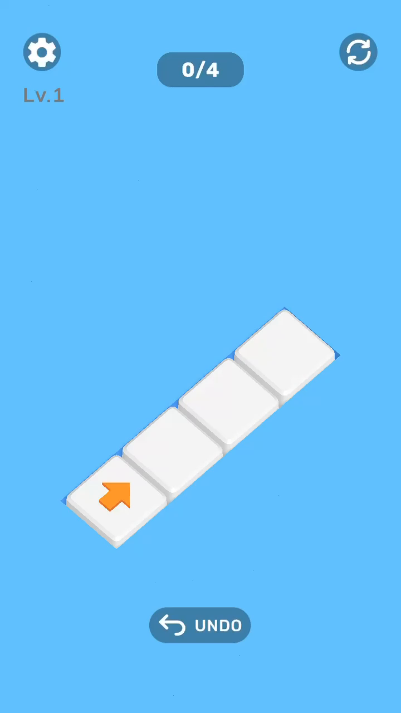

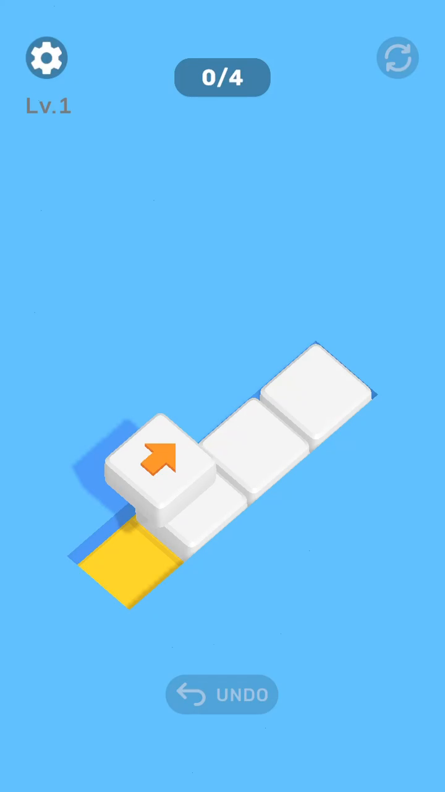

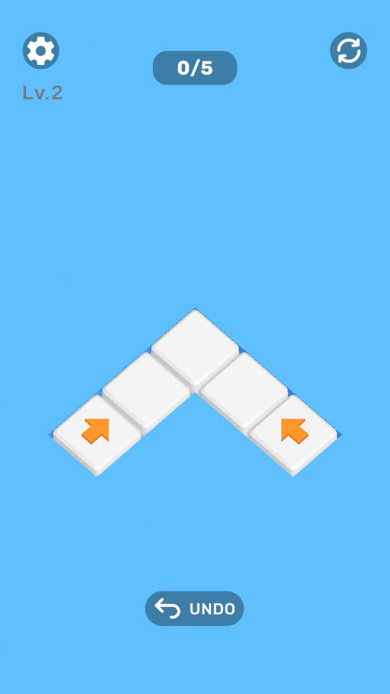

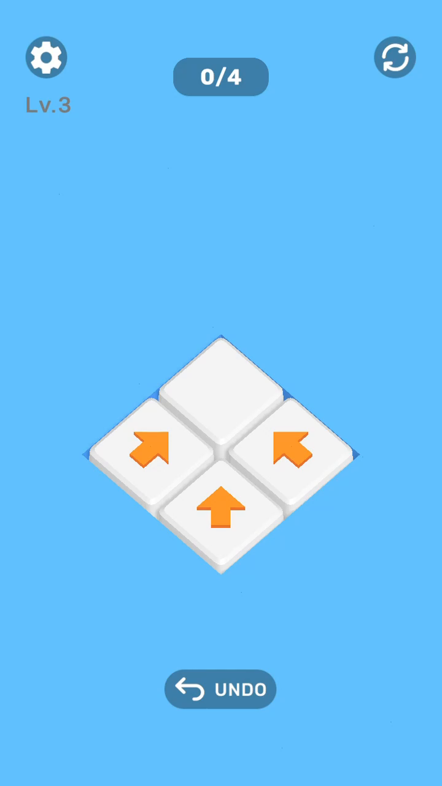

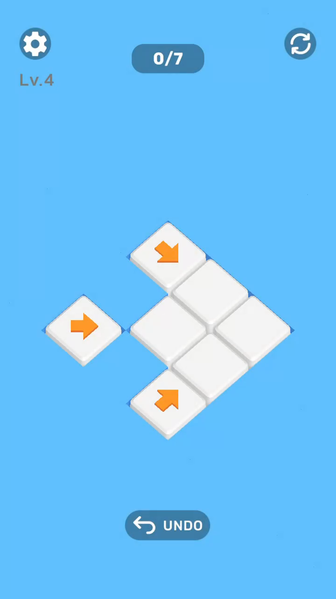

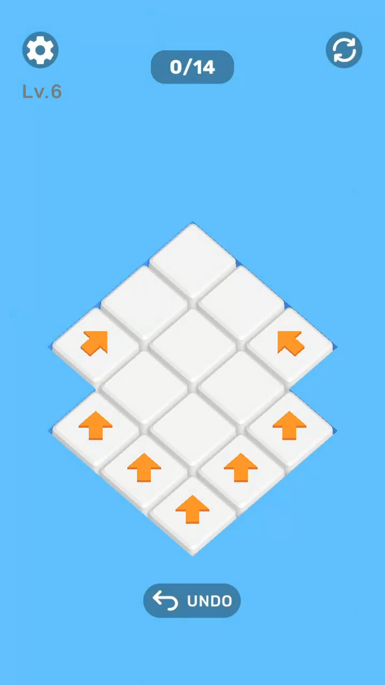

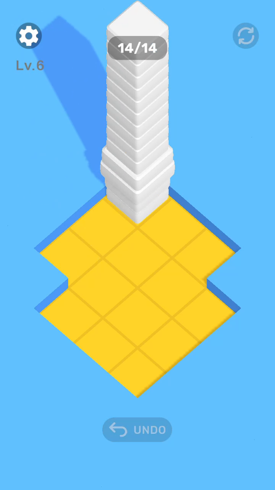

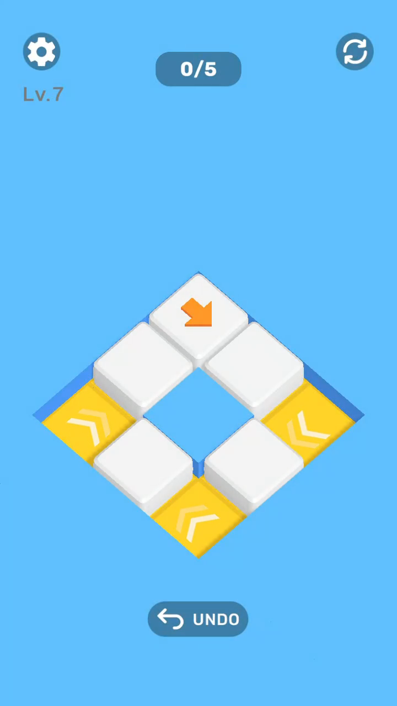

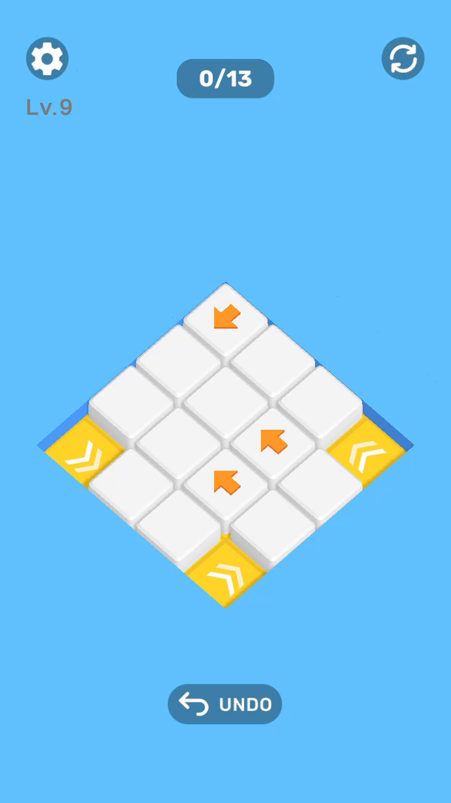

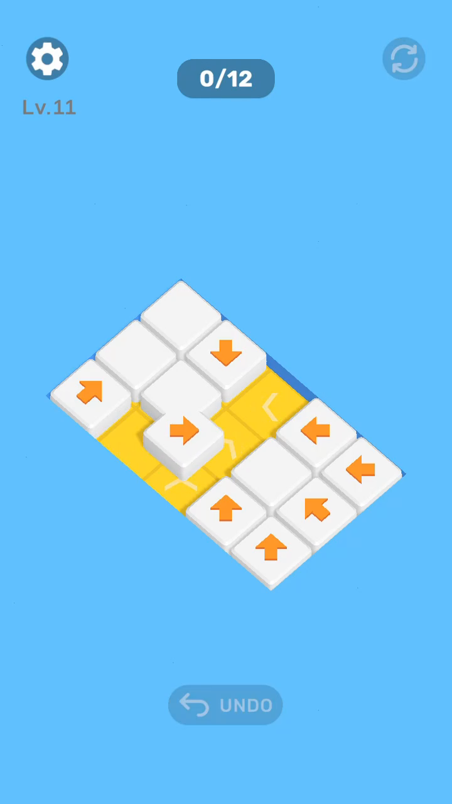

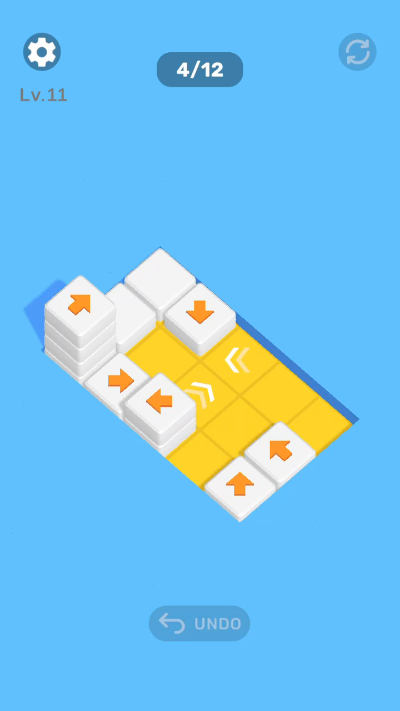

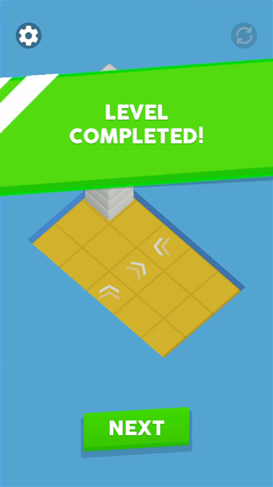
